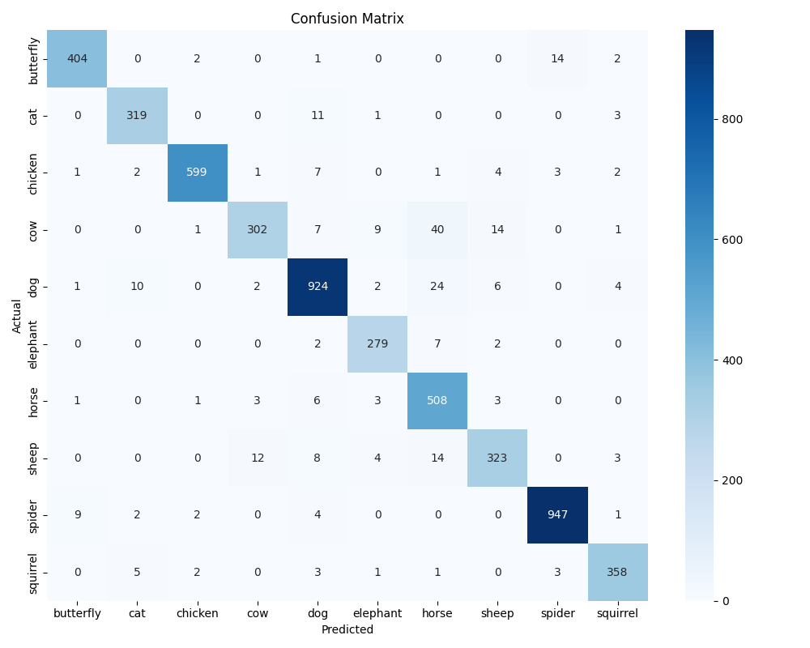
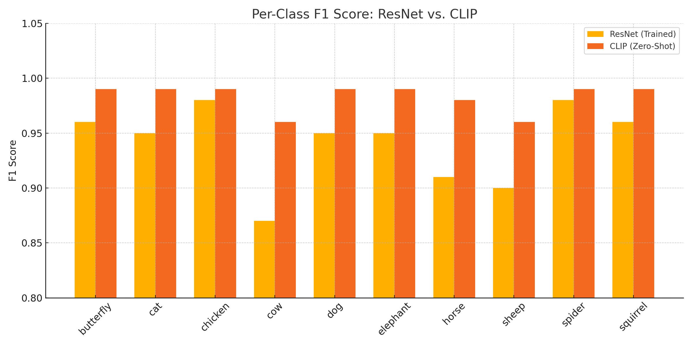

### 🐾 Dataset Setup (for Lightning AI)
1. Download from: https://drive.google.com/file/d/14q2Qf9mukDZTZWcHMgjLbECtGd_UESHj/view?usp=sharing
2. Unzip into: `data/animals10/`

✅ Classification Report:

              precision    recall  f1-score   support

   butterfly       0.97      0.96      0.96       423
         cat       0.94      0.96      0.95       334
     chicken       0.99      0.97      0.98       620
         cow       0.94      0.81      0.87       374
         dog       0.95      0.95      0.95       973
    elephant       0.93      0.96      0.95       290
       horse       0.85      0.97      0.91       525
       sheep       0.92      0.89      0.90       364
      spider       0.98      0.98      0.98       965
    squirrel       0.96      0.96      0.96       373

    accuracy                           0.95      5241
   macro avg       0.94      0.94      0.94      5241
weighted avg       0.95      0.95      0.95      5241

### 🔍 Confusion Matrix

## 🔍 Zero-Shot Classification (CLIP)

Model used: `openai/clip-vit-base-patch32`

CLIP was evaluated on the Animals-10 validation set using the 10 class labels as natural language prompts.

### 🔢 Results

- **Accuracy:** 99%
- **Macro F1-score:** 98%
- **Weighted F1-score:** 99%

| Class     | Precision | Recall | F1-score | Support |
|-----------|-----------|--------|----------|---------|
| butterfly | 0.98      | 1.00   | 0.99     | 423     |
| cat       | 0.99      | 0.99   | 0.99     | 334     |
| chicken   | 0.99      | 0.99   | 0.99     | 620     |
| cow       | 0.97      | 0.96   | 0.96     | 374     |
| dog       | 1.00      | 0.98   | 0.99     | 973     |
| elephant  | 0.99      | 1.00   | 0.99     | 290     |
| horse     | 0.97      | 1.00   | 0.98     | 525     |
| sheep     | 0.97      | 0.96   | 0.96     | 364     |
| spider    | 1.00      | 0.99   | 0.99     | 965     |
| squirrel  | 0.98      | 1.00   | 0.99     | 373     |

## 🔍 Model Comparison: Trained ResNet vs. CLIP (Zero-Shot)

| Class     | F1-score (ResNet) | F1-score (CLIP) |
|-----------|-------------------|-----------------|
| butterfly | 0.96              | 0.99            |
| cat       | 0.95              | 0.99            |
| chicken   | 0.98              | 0.99            |
| cow       | 0.87              | 0.96            |
| dog       | 0.95              | 0.99            |
| elephant  | 0.95              | 0.99            |
| horse     | 0.91              | 0.98            |
| sheep     | 0.90              | 0.96            |
| spider    | 0.98              | 0.99            |
| squirrel  | 0.96              | 0.99            |
| **Macro Avg** | **0.94**     | **0.98**        |
| **Accuracy**  | **95%**       | **99%**         |

### 🧠 Insights

- CLIP outperforms the trained ResNet in nearly every category — especially on `cow`, `horse`, and `sheep`, where your model underperformed slightly.
- Your model still performed **very well**, with an average F1-score of **94%**.
- This shows the power of zero-shot models like CLIP, while also validating the effectiveness of transfer learning with a small dataset.

### 📈 Model Comparison: Visual

