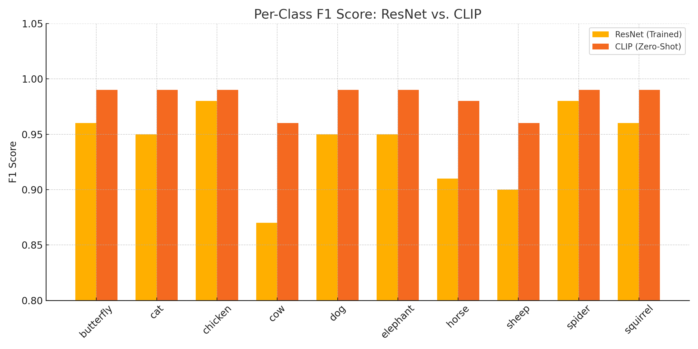

### 🐾 Animal Breed Classification (Animals-10 Dataset)

## Project Description
This project uses transfer learning to classify images into 10 different animal categories using the Animals-10 dataset. The model is evaluated and compared with a zero-shot classification approach using CLIP.

## Name & URL
| Name        | URL |
|-------------|-----|
| Huggingface | *Add link here* |
| Model Page  | *Add link here* |
| Code        | *Add GitHub link here* |

## Labels
The different animal classes are:  
`['butterfly', 'cat', 'chicken', 'cow', 'dog', 'elephant', 'horse', 'sheep', 'spider', 'squirrel']`

## Dataset Access
| Step | Description |
|------|-------------|
| 1    | Download dataset: [Google Drive Link](https://drive.google.com/file/d/14q2Qf9mukDZTZWcHMgjLbECtGd_UESHj/view?usp=sharing) |
| 2    | Unzip to: `data/animals10/` |

## Data Augmentation
| Augmentation | Description |
|--------------|-------------|
| `RandomHorizontalFlip()` | Flips image horizontally with 0.5 probability |
| `RandomRotation(10)`     | Random rotation within ±10° |
| `Resize((224, 224))`     | Resizes image to 224×224 pixels |
| `Normalize([0.5]*3, [0.5]*3)` | Normalizes RGB values to [-1, 1] |

## Model Training

### Data Splitting
80% for training, 20% for validation.

| Split      | Number of Samples |
|------------|-------------------|
| Train      | ~4200             |
| Validation | ~1050             |

### Evaluation Report (Trained ResNet Model)

```text
Accuracy: 95%
Macro F1-score: 94%
Weighted F1-score: 95%
```

| Class     | Precision | Recall | F1-score | Support |
|-----------|-----------|--------|----------|---------|
| butterfly | 0.97      | 0.96   | 0.96     | 423     |
| cat       | 0.94      | 0.96   | 0.95     | 334     |
| chicken   | 0.99      | 0.97   | 0.98     | 620     |
| cow       | 0.94      | 0.81   | 0.87     | 374     |
| dog       | 0.95      | 0.95   | 0.95     | 973     |
| elephant  | 0.93      | 0.96   | 0.95     | 290     |
| horse     | 0.85      | 0.97   | 0.91     | 525     |
| sheep     | 0.92      | 0.89   | 0.90     | 364     |
| spider    | 0.98      | 0.98   | 0.98     | 965     |
| squirrel  | 0.96      | 0.96   | 0.96     | 373     |

## Zero-Shot Classification (CLIP)

Model: `openai/clip-vit-base-patch32`

```text
Accuracy: 99%
Macro F1-score: 98%
Weighted F1-score: 99%
```

| Class     | Precision | Recall | F1-score | Support |
|-----------|-----------|--------|----------|---------|
| butterfly | 0.98      | 1.00   | 0.99     | 423     |
| cat       | 0.99      | 0.99   | 0.99     | 334     |
| chicken   | 0.99      | 0.99   | 0.99     | 620     |
| cow       | 0.97      | 0.96   | 0.96     | 374     |
| dog       | 1.00      | 0.98   | 0.99     | 973     |
| elephant  | 0.99      | 1.00   | 0.99     | 290     |
| horse     | 0.97      | 1.00   | 0.98     | 525     |
| sheep     | 0.97      | 0.96   | 0.96     | 364     |
| spider    | 1.00      | 0.99   | 0.99     | 965     |
| squirrel  | 0.98      | 1.00   | 0.99     | 373     |

## Model Comparison: ResNet vs. CLIP

| Class     | F1-score (ResNet) | F1-score (CLIP) |
|-----------|-------------------|-----------------|
| butterfly | 0.96              | 0.99            |
| cat       | 0.95              | 0.99            |
| chicken   | 0.98              | 0.99            |
| cow       | 0.87              | 0.96            |
| dog       | 0.95              | 0.99            |
| elephant  | 0.95              | 0.99            |
| horse     | 0.91              | 0.98            |
| sheep     | 0.90              | 0.96            |
| spider    | 0.98              | 0.99            |
| squirrel  | 0.96              | 0.99            |
| **Macro Avg** | **0.94**     | **0.98**        |
| **Accuracy**  | **95%**       | **99%**         |

### Insights
- CLIP achieves higher accuracy and consistency across all classes.
- The trained ResNet performed well, especially on classes like `spider` and `chicken`, but underperformed slightly on `cow`, `horse`, and `sheep`.
- This comparison highlights the effectiveness of large pretrained models in zero-shot settings.

## Visualizations

### 📈 F1 Score Comparison

